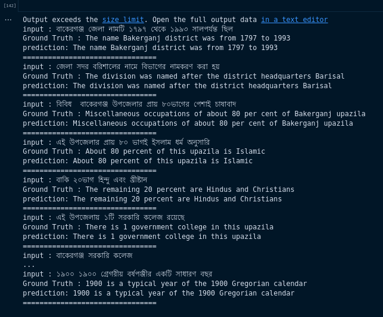

# Bangla_Translation
Translate bangla to english. This model is train based on encoder decoder with attention mechanism. This repository may be a starting point to approaching bangla machine translation problem. If this repository helps others people who are working on bangla machine translation then it would be very greatfull for me. Here we have used 195775 number of sentence pair Bangla to English sentences. We used sentencepice tokenizer for both language and the vocab have defined size = 30000. 

Using the Bangla dataset, I was able to achieve a BLEU score of ___ on the total dataset[195775 sentence] this model was train 24 hours on single GPU  24gb GPU.

Paper link of Transformer model : 

# Requirements
```
numpy==1.19.5
sentencepiece==0.1.97
tokenizers==0.8.1rc1
torch==1.11.0+cu113
torchsummary==1.5.1
torchtext==0.12.0
torchvision==0.12.0+cu113
transformers==3.0.2
nltk==3.7 
```

# Dataset
We have collected ```195775``` number of sentence  pair ```Bangla to English```. we seperated bangla and english sentence using ```\t```.
Data representation into txt file:
```
তারা হলের প্রোভস্টের বাড়িতেও প্রবেশ করে	They enter the house of the provost of the hall 
তার ঘোষণা মতে ২ আগস্ট থেকে ক্লাস শুরুর কথা ছিল	According to his announcement, the class was to start from August 2 
তখন সকল পরীক্ষা স্থগিত ছিল	Then all the tests were suspended 
ঐ সময় ক্লাসে ছাত্রদের উপস্থিতি ছিল খুব কম	Attendance of students in the class was very low at that time 
প্রতিদিনই প্রায় কলাভবনে গ্রেনেড বিস্ফোরন হত	Grenades exploded in Kalabhavan almost every day 
রাউলিং বলেন  তাঁর সবসময়ই মনে হয় যে ডাম্বলডোর সমকামী	Rowling said he always thinks Dumbledore is gay 
তিনি গেলার্ট গ্রিন্ডেলওয়াল্ডের প্রেমে পড়েছিলেন	He fell in love with Gelart Grindelwald 
তিনি ব্রহ্মচর্য ও পুথিগত জীবনকেই বেছে নেন	He chose celibacy and bookish life 
```
Available Public dataset:
I use dataset provide in http://www.manythings.org/anki/ben-eng.zip . This dataset contain english bangla sentence pair in the following format.

# Train Sentencepice Tokenizer:
```
import sentencepiece as spm
text_path = "dataset.txt"
vocab_size = 30000
spm.SentencePieceTrainer.train(f'--input={text_path} --model_prefix={model_prefix} --user_defined_symbols=<sep>,<cls> --vocab_size={vocab_size}')
bn_sp = spm.SentencePieceProcessor()
bn_sp.load(os.path.join(model_path, 'bn_model.model'))
```
# Configuration
Here the training configuration of Transformer model and it's additional parameters:
```
-epochs : 300
-batch_size : 150
-n_layers : 6 
-heads : 8
-no_cuda : 
-SGDR : 
-d_model :512
-dropout' : 0.1
-lr : 0.0001

```
# Training

For Training here, i have attached BnTranslation.ipynb file. so we can use this ipython file for your custom data training purpose.
```
BnTranslation.ipynb 
```

# Pretrain Model
Chcek the training model [click here]()

# Inference
```
python inference.py --data "এই উপজেলায় ১টি সরকারি কলেজ রয়েছে" \
--bn_tokenizer ./model/bn_model.model --en_tokenizer ./model/en_model.model\
--bn_vocab ./model/bn_vocab.pkl --en_vocab ./model/en_vocab.pkl --model ./model/model_checkpoint.pt
````
Also can use ```inference.ipynb``` file



# Evaluation

```
python evaluation.py --data process_data/merge_data.txt --bn_tokenizer ./model/bn_model.model --en_tokenizer ./model/en_model.model\
--bn_vocab ./model/bn_vocab.pkl --en_vocab ./model/en_vocab.pkl --model ./model/model_checkpoint.pt

```


# Experiemnt Machine Configuration,
```
NVIDIA Driver Version: 470.161.03
CUDA Version: 11.2
NVIDIA GeForce 3090 : 24 GB
```
# References
1. https://torchtutorialstaging.z5.web.core.windows.net/beginner/translation_transformer.html
2. https://arusl.medium.com/japanese-english-language-translation-with-transformer-using-pytorch-243738146806
3. https://github.com/hyunwoongko/transformer
4. https://www.kaggle.com/datasets/ari994/banglaenglishtransliteration


